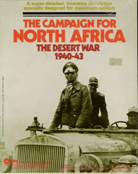
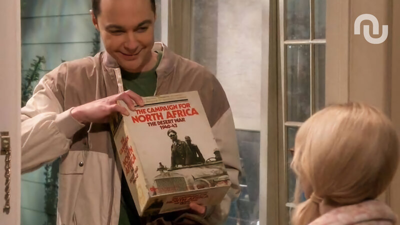

# Rules for The Campaign for North Africa



Rules transcription of the SPI game The Campaign of North Africa

## 📥 Download Rules

The rules are available in PDF and EPUB format for direct download:

- 📄 **[Download PDF](https://github.com/tonicebrian/TheCampaignForNorthAfrica/releases/latest/download/CNA-Rules.pdf)** - Version for printing or reading on computer
- 📱 **[Download EPUB](https://github.com/tonicebrian/TheCampaignForNorthAfrica/releases/latest/download/CNA-Rules.epub)** - Version for e-readers

> **Note:** The original rules from which these documents have been OCR-ed and generated can be found here: https://www.spigames.net/PDFv2/CampaignNorthAfrica.pdf

## 🛠️ Building the Rules Yourself

If you want to build the PDF and EPUB files locally, follow these steps:

### Prerequisites

You need Ruby installed on your system. Then install the required gems:

```bash
gem install asciidoctor
gem install asciidoctor-pdf
gem install asciidoctor-epub3
gem install pygments.rb
```

### Building

**Generate PDF:**

```bash
asciidoctor-pdf -o CNA-Rules.pdf CNA-Rules.adoc
```

**Generate EPUB:**

```bash
asciidoctor-epub3 -o CNA-Rules.epub CNA-Rules.adoc
```

The generated files will be created in the current directory.

---


